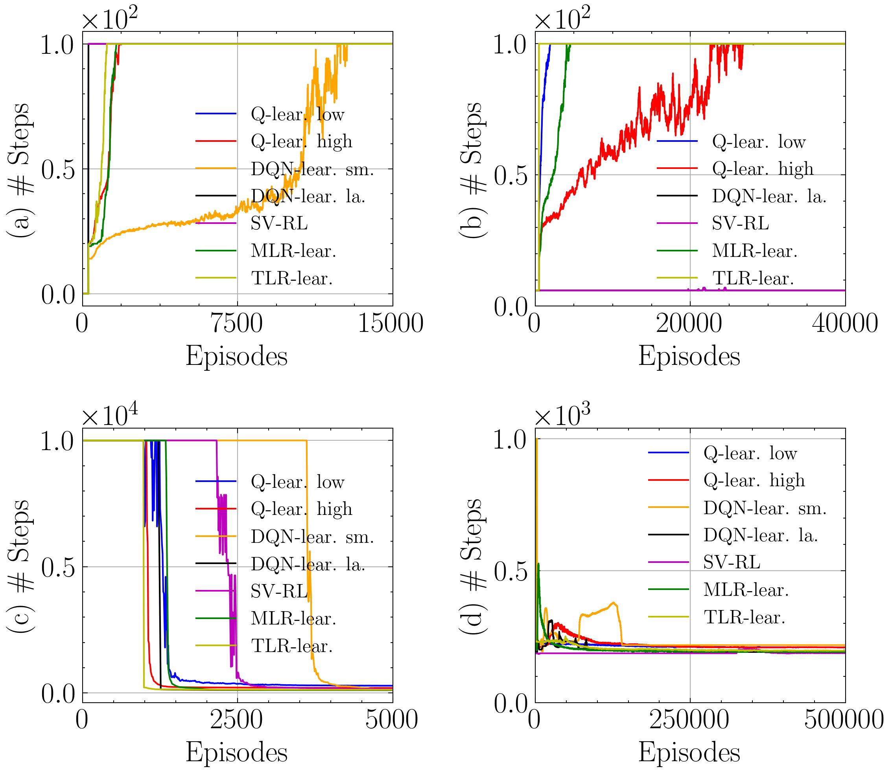

# Tensor and Matrix Low-Rank Value-Function Approximation in Reinforcement Learning

by
Sergio Rozada,
Santiago Paternain,
and Antonio G. Marques

This code belongs to a paper that has been submitted for publication in *IEEE Transactions on Signal Processing*.

> The associated paper presents low-rank matrix models for function approximation value-based methods. They are easy to tune, and parametrize. They outperform neural networks in terms of size, speed of convergence and returns.

    

*Median return per episode in four standard RL problems:
(a) the pendulum, (b) the cartpole, (c) the mountain car, and (d) the Goddard rocket.*

## Abstract

> Value-function (VF) approximation is a central problem in Reinforcement Learning (RL). Classical non-parametric VF estimation suffers from the curse of dimensionality. As a result, parsimonious parametric models have been adopted to approximate VFs in high-dimensional spaces, with most efforts being focused on linear and neural-network-based approaches. Differently, this paper puts forth a a parsimonious non-parametric approach, where we use stochastic low-rank algorithms to estimate the VF matrix in an online and model-free fashion. Furthermore, as VFs tend to be multi-dimensional, we propose replacing the classical VF matrix representation with a tensor (multi-way array) representation and, then, use the PARAFAC decomposition to design an online model-free tensor low-rank algorithm. Different versions of the algorithms are proposed, their complexity is analyzed, and their performance is assessed numerically using standardized RL environments. 

## Software implementation

All source code used to generate the results and figures in the paper are in the `src` folder. The calculations and figure generation are all done by running:
* `1_exp_svd_policy_iteration.py`
* `2_exp_svd_q_learning.py`
* `3_exp_svd_policy_reward.py`
* `4_exp_parafac_q_learning.py`
* `5_exp_methods_comparison.py`
* `6_exp_methods_scalability.py`
* `7_exp_high_dimensional_space.py`

Results generated by the code are saved in `results`, and figures are saved in `figures`.

## Getting the code

You can download a copy of all the files in this repository by cloning the
[git](https://github.com/sergiorozada12/tensor-low-rank-rl) repository:

    git clone https://github.com/sergiorozada12/tensor-low-rank-rl.git

or [download a zip archive](https://github.com/sergiorozada12/tensor-low-rank-rl/archive/refs/heads/main.zip).

## Dependencies

You'll need a working Python environment to run the code.
The recommended way to set up your environment is through [virtual environments](https://docs.python.org/3/library/venv.html). The required dependencies are specified in the file `requirements.txt`.
